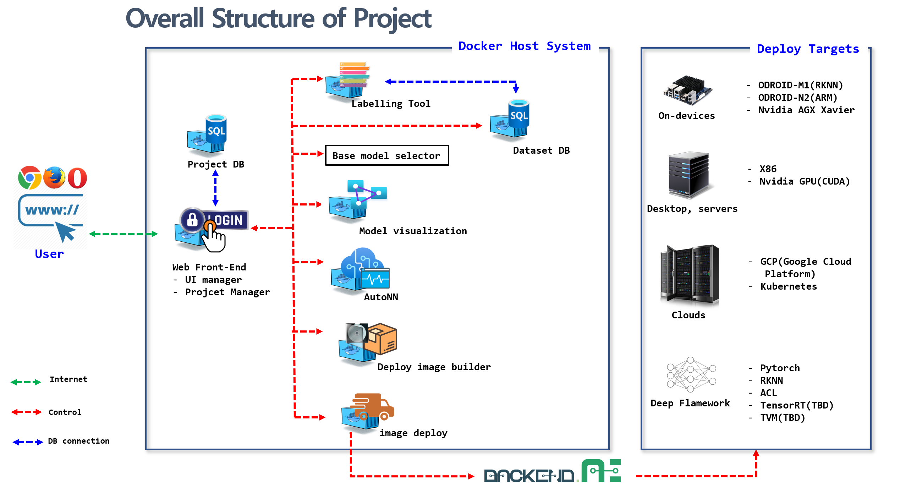
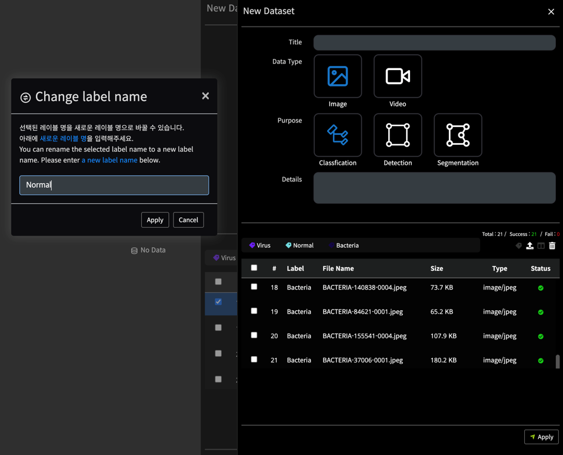
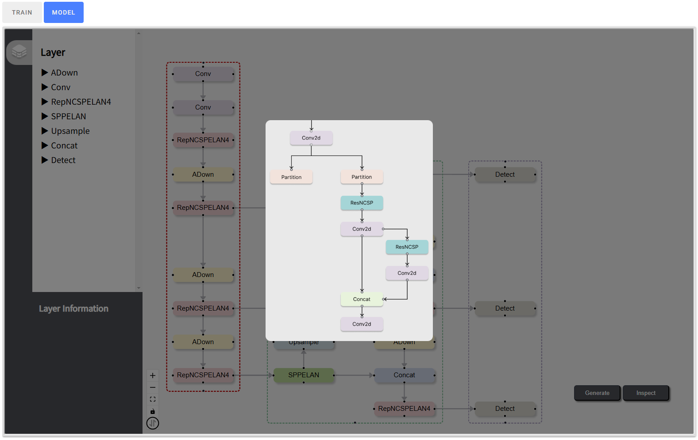
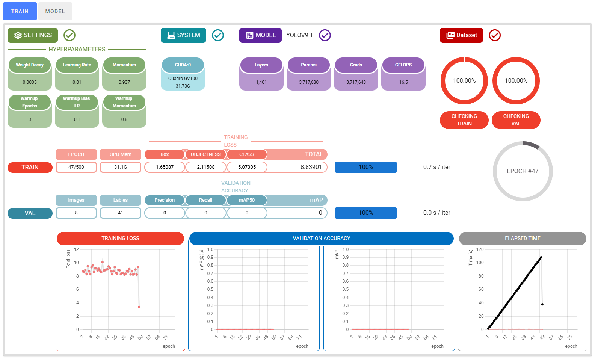
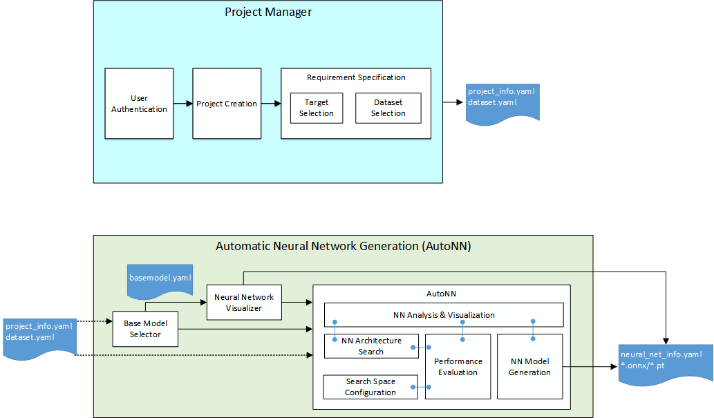
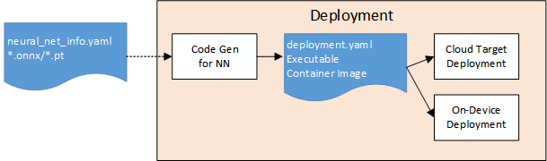

# TANGO

> **Announcement**
> * [2025 October TANGO Release](https://github.com/ML-TANGO/TANGO/releases/tag/tango-25.10)
> 
----

## Introduction to TANGO <a name="intro"></a>

TANGO (**T**arget **A**ware  **N**o-code neural network **G**eneration and **O**peration framework) is code name of project for Integrated Machine Learning Framework.

It aims to develop automatic neural network generation and deployment framework that helps novice users to easily develop neural network applications with less or ideally no code efforts and deploy the neural network application onto the target device.

#### No Code
> 
> The TANGO framework aims to help users without specialized knowledge to create and use their own neural network models. To this end, it provides an environment that users can use without writing code, such as a project manager and a neural network visualization tool. The users of TANGO just prepare their labelled datasets to train models and target devices. Then, TANGO analyzes the datasets and target devices characteristics, generates task-specific neural network based on user requirements, trains it with the datasets, creates Docker container images and deploys the container images onto target device.

TANGO uses container technology and MSA (Micro Service Architecture). Containers require less system resources than traditional or hardware virtual machine environments because they don't include operating system images. Applications running in containers can be deployed easily to multiple different operating systems and hardware platforms.

Each component of TANGO is self-contained service component implemented with container technology.
The component interacts with other component via REST APIs as depicted in the following image;



----

## Main Feature of TANGO

The TANGO framework aims to deploy and load ready-to-use deep learning models for the specific vision task (classification, object detection, or instance segmentation) onto the user's target devices by automatically constructing and training deep learning models without the help of experts or with minimal knowledge on usage on TANGO. To this end, data preparation, neural network model creation, and optimization for target device can be accomplished within TANGO framework.

  
### Data Preparation

Data preparation consists of two main processes. First, you need to take or collect images (raw data) in various situations suitable for the given vision task. Then, collected row data should be annotated to be used for training of depp learning models. The latter process is very labor intensive and takes a lot of manpower and time. TANGO's labeling tool is a Web-based GUI tool that enables the users easily perform annotation on raw data. The user can load local raw data by just drag and drop style, perform class labeling, bounding box annotation, polygon annotation, etc. according to the specific task, and then save them.



### Base Model Selection

Before applying automation techniques such as NAS and HPO, reducing the search space or limiting it to a specific neural network variation is very important in terms of the efficiency of automatic neural network generation. In the TANGO framework, it was named Base Model Selection and was assigned a role of recommending an appropriate neural network among existing well-known neural networks, so called SOTA model.

Currently, TANGO selects a base model according to dedicated rules with the number of class and the size of GPU memeory as following.

| Task | Class count | Base Model | Mem <= 2G | Mem <= 4G | Mem <= 6G | Mem <= 8G | Mem <=10 | Mem <=12 | Mem > 12G | NAS |
|------|:-----------:|:----------:|:---------------:|:---------:|:---------:|:---------:|:--------:|:--------:|:---------:|:---:|
| _Detection_ | <= 50 | **`YOLOv7`** |-tiny | -x | -x | -w6 | -e6 | -d6 | -e6e | v7-super|
|  | > 50 | **`YOLOv9`** | -t | -s | -m | -m | -c | -e | -e | v7-super |
| _Classification_ | <= 10 | **`ResNet-Cifar`** | 20 | 32 | 44 | 56 | 110 | 152 | 200 | - |
| | > 10 | **`Original ResNet`** | 18 | 34 | 50 | 50 | 101 | 152 | 152 | - |


### Visualization

It is important that user recognizes the neural network model architecture, so TANGO provides visual description on the base model. 



As you can see this example, model visualization provides

* Node-Edge based model visualization
* More intrinsic edge types (e.g. arrow lines, which indicts the forwarding direction clearly)
* Pop-up shows the internal structure on complicate blocks
* Backbone, neck, head layouts for detection model  

In other hands, it makes sure users want to look at the progress of training, so TANGO provides another tab to show graphs and numbers over training periods.



Training graph provides

* REST APIs to indict step-by-step progress information
* reports training status in period and visualized on the dash board

### Automatic Neural Network Generation

AutoML (Automated Machine Learning) refers to the process of automating the end-to-end machine learning process, including tasks such as data preprocessing, model selection, hyperparameter tuning, and model deployment. The goal of AutoML is to make it easier for non-experts to build and deploy machine learning models, by removing the need for extensive domain knowledge or manual intervention.

Neural network model generation is a key process in the TANGO framework. The TANGO framework provides guidelines for this kind of task automatically. First, a base neural network is extracted through a base model selector recommended by one of the existing SOTA, State of the Art, neural networks proved to work well. Afterwards, AutoNN uses automation techniques such as NAS ([Neural Architecture Search](https://en.wikipedia.org/wiki/Neural_architecture_search)) and HPO ([Hyper Parameter Optimization](https://en.wikipedia.org/wiki/Hyperparameter_optimization)) to find an appropriate neural network configuration. This includes retraining of the final model.



AutoNN provides a number of automated ways to find proper models that match user requirements.
* ***Automatci Bag-of-Freebie*** 
   - Auto-batch: extract maximum  batch size considering model size and GPU memory, if out-of-memory happens, it resumes with smaller batch size
   - Early-stop: stop if any improvement is not coming out, it helps for model not over-fitting datasets
   - Augmentation: support mosaic training (4 or 9 pieces)
   - Hyperparameter tuning: optimize hyperparameter(number) based on Baysien algorithm
   - Auxiliary heads: it helps better precision during training, and then it is reparameterized into the single head model for interference at the end of training
* ***Automatic Bag-of-Specials*** 
   - Target-specific NAS: it results in proper accuracy and latency on Android phone
* ***Automatic Model Export*** 
   - Seamless transition to the target (with a cooperation of `CodeGen`)
   - pt / onnx / torchscript / tensorflow / TFLite / TPU model conversion without any user interruption
   - support layer fusing, re-parameterization, input size variation, half-precision, INT8 quantization
 
#### NAS: Neural Architecture Search

Neural Architecture Search (NAS) is a method for automatically searching for the best neural network architecture for a given task, rather than requiring the practitioner to manually design and fine-tune the network. The process of NAS involves searching the space of possible network architectures to find the one that performs best on a validation dataset. 

NAS has the potential to significantly reduce the time and effort required to design neural networks, especially for complex tasks where the optimal architecture is not clear. It also enables the discovery of novel network architectures that outperform hand-designed ones, leading to improved performance on a wide range of tasks. However, NAS can be computationally expensive and require large amounts of computing resources, making it challenging to apply in practice.

Finding the optimal neural network has long been the domain of AI experts. As the basic operations, layers, and blocks used in neural networks become matured, finding a better neural network architecture through combining them can be iterative work. Therefore, rather than finding a new operation, layer, or block, NAS technology uses the computer with the task of finding a better neural network structure from the possible combination of developed operations, layers, and blocks or changing their parameters. NAS in TANGO can be seen as a process of deriving an optimal user-customized neural network through NAS based on the base neural network recommended by BMS.


#### HPO: Hyper-Parameter Optimization

Even though neural network training is largely automated, there are still many variables that should be setup in advance or tunned during training. This kind of variables is called hyper-parameters. HPO stands for Hyperparameter Optimization, which is the process of tuning the hyper-parameters of a machine learning model to improve its performance on a validation dataset. Hyper-parameters are parameters that are set before training a model and control aspects of the training process such as the learning rate, the number of trees in a random forest, or the number of hidden units in a neural network. Therefore, HPO in TANGO can be seen as an iterative process of determining the optimal values of hyper-parameters to achieve the best performance for the optimal neural network derived from NAS.


####
### Target Deployment of Trained Model

During TANGO project configuration, users can specify theirs target(cloud, K8S, ondevice), which is used for inference with trained neural network model. Due to different acceleration engines and available resources for each target environment, it is difficult to deploy immediately the neural network model generated from AutoNN. Depending on the target environment, TANGO makes the executable code including essential libraries and pre/post-processing code into a compressed file, builds containerized image, and installs it on the the target(device) and unpacks it.



The supported target(cloud, K8S, ondevice) is as follows.  
| Target | NN acceleration | Runtim Engine | remark |
|-------|------------------|---------------|--------|
|Amazon Web Services (AWS)  |     | PyTorch/TorchScript, TensorRT | Elastic Container Service (ECS) |
| Google Cloud Platform (GCP) |   | PyTorch/TorchScript,TensorRT | Google Cloud Run |
|KT cloud|                        |     PyTorch/TorchScript,TensorRT | in progress |
| Kubernetes | x86 + NVIDIA GPU | PyTorch/TorchScript, TensorRT | |
| PC |  x86 + NVIDIA GPU | PyTorch/TorchScript, ONNX, OpenVINO, TensorRT, TVM | |
| Comma 3X (Snapdragon 845) | ARM + Adreno 630 GPU | PyTorch/TorchScript, ONNX |in progress |
| Jetson AGX Orin | ARM + NVIDIA GPU (Ampere)  | TensorRT, PyTorch/TorchScript | |
| Jetson AGX Xavier | ARM + NVIDIA GPU (Volta) | TensorRT, PyTorch/TorchScript | |
| Jetson Nano | ARM + NVIDIA GPU (Maxwell) | TensorRT, PyTorch/TorchScript | |
| Samsung Galaxy S23 | ARM + Adreno 740 GPU | Tensorflow Lite | |
| Samsung Galaxy S22 | ARM + Adreno 730 GPU | Tensorflow Lite | |
| Rasberry Pi5 | ARM + Google Coral M.2 PCIe TPU |Tensorflow Lite | |
| Odroid N2  | ARM + Mali GPU | TVM, ACL | YoloV3 supporting | |
| Odroid M1 | ARM + RKNN NPU |  RKNN | YoloV7 supporting |

 #### Neural Network Deployment technology

The neural network deployment module provides functions for optimizing the neural network model, generating executable code for inference, distributing to the target, and automating execution for each target's computing environment/inference engine/execution environment.

##### Key features of the Neural Network Deployment Module:

* Ability to convert neural network models into executable code  
The neural network deployment module provides an automatic generation function for executable code templates, such as pre-processing code for neural network input and post-processing code for interpreting neural network output, so that the neural network model can be operated on the operating system, programming language, and inference engine.

* Ability to optimize the neural network model to suit the target environment  
The neural network deployment module provides neural network model optimization functions such as quantization so that the neural network model can operate in the target environment, such as CPU performance and available memory size.

* Diversity support function of neural network accelerators  
The neural network deployment module provides functions to make full use of accelerators such as NVIDIA GPU, Tensor Processing Unit, and ARM Mali GPU.

* Support for diversity of inference engines  
The neural network deployment module provides various inference engine support functions such as PyTorch, TensorRT, TVM, and Tensorflow Lite.

* Providing convenience of distribution and installation  
The neural network deployment module provides a convenient deployment feature that automates the deployment process to GCP, AWS, etc. as much as possible.

##### Deployment Module’s operation depending on targets

> * Web services such as GCP/AWS  
> pytorch model -> Create a PyTorch-based web application service -> Create a POD for K8S -> Deploy/execute the POD using the deployment environment set by the user.
>
> * Smartphone  
> Model for PyTorch -> Convert to ONNX model -> Integer Quantization -> Convert to Tensorflow Lite model -> Generate neural network execution code for Android -> Generate executable file (.apk) for Android
>
> 
> * Raspberry Pi+TPU(Tensor Processing Unit)
> Model for PyTorch -> Convert to ONNX model -> Convert to Tensorflow Lite model -> Convert to model for TPU -> Generate Python-based neural network execution code for TPU 
>
> 
> * TensorRT-based devices  
> Model for PyTorch -> Convert to ONNX model -> Generate Python-based  ONNX-TensorRT converter and execution code for TensorRT
>
> 
> * TVM-based devices  
> Model for PyTorch -> Convert to ONNX model -> Convert to model for TVM -> Generate Python-based neural network execution code for TVM
>


---- 

## How to build images and run containers <a name="img_build_container_run"></a>

refer to TANGO wiki [HowTo | TANGO Image Build and Run](https://github.com/ML-TANGO/TANGO/wiki/HowTo-%7C-TANGO-Image-Build-and-Run)


----

## Developer Guides and References<a name="dev_guides"></a>

* [TANGO Architecture Overview](https://github.com/ML-TANGO/TANGO/wiki/Guides-%7C-TANGO-Architecture)
* [TANGO Container Port Mapping guide](https://github.com/ML-TANGO/TANGO/wiki/Guides-%7C-Container-Port-Map)
* [Exchanging Data among Containers](https://github.com/ML-TANGO/TANGO/wiki/Guides-%7C-Exchanging-Data-among-Containers)
* [TANGO REST API Guide](https://github.com/ML-TANGO/TANGO/wiki/Guides-%7C-Rest-API)
* [how to prepare dataset for classification.pdf](https://github.com/user-attachments/files/17841949/how.to.prepare.dataset.for.classification.pdf)
----


## Source Tree Structure <a name="source_tree"></a>

The source tree is organized with the MSA principles: each subdirectory contains component container source code. Due to the separation of source directory, component container developers just only work on their own isolated subdirectory and publish minimal REST API to serve project manager container's service request.

```bash
TANGO
  ├─── docker-compose.yml
  ├─── project_manager
  ├─── autonn
  │      └─── autonn
  ├─── deploy_codegen 
  │      └─── optimize_codegen
  └─── deploy_targets
         ├─── cloud
         ├─── k8s
         └─── ondevice
```

----

## TANGO 커뮤티니 컨퍼런스

* 행사 안내 사이트 : http://tangoai.or.kr

* [2022 TANGO 커뮤니티 제1회 컨퍼런스 발표자료](https://github.com/ML-TANGO/TANGO/tree/main/docs/2022_Fall_Community_Conference)
* [2023 TANGO 커뮤니티 제2회 컨퍼런스 발표자료](https://github.com/ML-TANGO/TANGO/tree/main/docs/2023_Fall_Community_Conference)
* [2024 TANGO 커뮤니티 제3회 컨퍼런스 발표자료](https://github.com/ML-TANGO/TANGO/tree/main/docs/2024_Fall_Community_Conference)

----

## TANGO on media

YouTube Videos
* [ 성공하는 SW기업을 위한 AI, SW개발도구 'TANGO'](https://youtu.be/IwyHOl3WjWQ)
  * 2022 SW공학 TECHNICAL 세미나, 떠오르는 기업의 품질 확보 활동 
  * 2022년 11월 23일(수) 15:30 ~ 17:30 
  * 비앤디파트너스 삼성역점 M3 회의실

* [TANGO, 노코드 신경망 자동생성 통합개발 프레임워크의 품질 관리](https://youtu.be/jrJCXAPKJn8)
  * 2022 SW QUALITY INSIGHT CONFERENCE
  * 2022년 12월 7일(수) 15:30~17:30 
  * COEX 그랜드 컨퍼런스룸 402호


----

## Acknowledgement <a name="ack"></a>

This work was supported by [Institute of Information & communications Technology Planning & Evaluation (IITP)](https://www.iitp.kr/) grant funded by the Korea government(MSIT) (**No. 2021-0-00766**, _Development of Integrated Development Framework that supports Automatic Neural Network Generation and Deployment optimized for Runtime Environment_).
