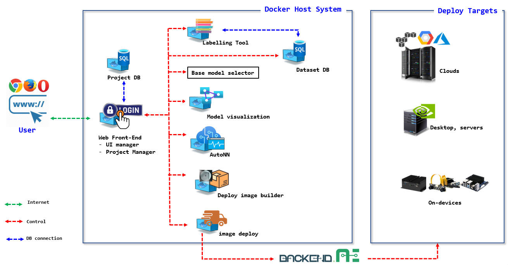
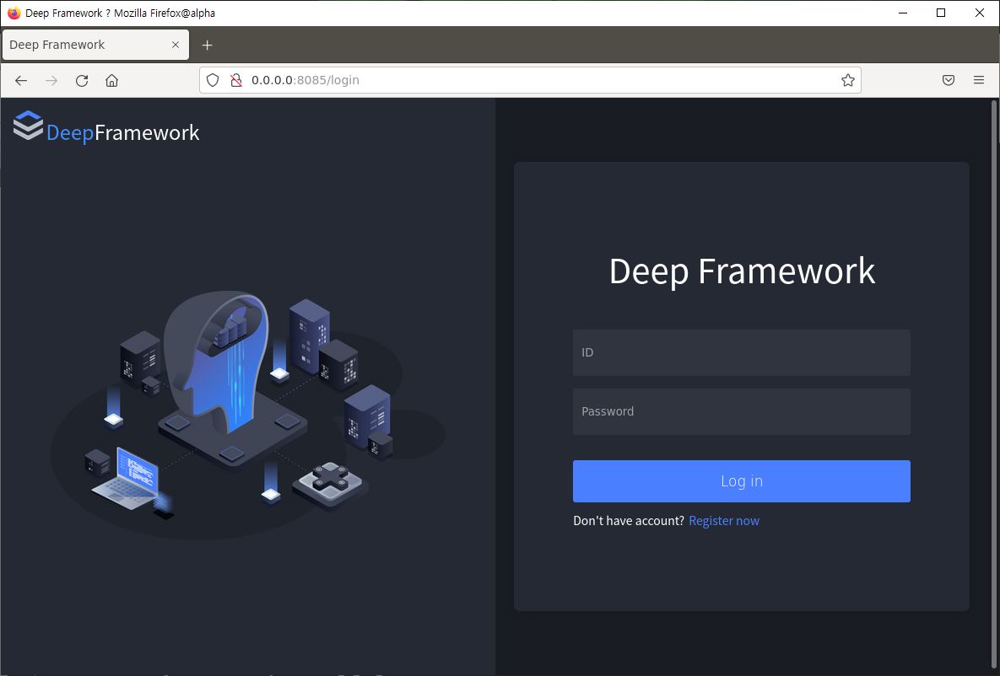

# TANGO

**Table of Contents**
* [Introduction to TANGO](#intro)
* [Source Tree Structure](#source_tree)
* [How to build images and run containers](#img_build_container_run)
  * [Docker and Docker-compose Installation](#docker_install)
  * [TANGO repository clone](#repo_clone)
  * [TANGO containers image build and run](#tango_run)
* [How to cleanup images and container instances outcomes](#clean_up)
* [How to run individual component containers](#per_container_run)
* [Developer Guides](#dev_guides)
* [Acknowledgement](#ack)

----

## Introduction to TANGO <a name="intro"></a>

TANGO (**T**arget **A**daptive  **N**o-code neural network **G**eneration and **O**peration framework) is code name of project for Integrated Machine Learning Framework.

It aims to develop automatic neural network generation and deployment framework that helps novice users to easily develop neural network applications with less or ideally no code efforts and deploy the neural network application onto the target device.

The users of TANGO just prepare their labelled datasets to train models and target devices. Then, TANGO analyzes the datasets and target devices characteristics, generates task-specific neural network based on user requirements, trains it with the datasets, creates Docker container images and deploys the container images onto target device.

TANGO uses container technology and MSA (Micro Service Architecture). Containers require less system resources than traditional or hardware virtual machine environments because they don't include operating system images. Applications running in containers can be deployed easily to multiple different operating systems and hardware platforms.

Each component of TANGO is self-contained service component implemented with container technology.
The component interacts with other component via REST APIs as depicted in the following image;



----

## Source Tree Structure <a name="source_tree"></a>

The source tree is organized with the MSA principles: each subdirectory contains component container source code. Due to the separation of work directory, component container developers just work on their own isolated subdirectory and publish minimal REST API to serve other component containers service request.

```bash
$ tree -d -L 2
.
├── project_manager            # front-end server for TANGO
│   ├── backend
│   ├── data
│   ├── tango
│   ├── frontend
│   └── static
│
├── labelling             # data labelling tool
│   ├── backend
│   └── labelling
│
├── base_model_select     # base model selection
│
├── autonn                # automatic neural network
│   ├── autonn
│   └── backend
│
├── target_image_build    # build neural network image to be deployed
│   ├── backend
│   └── target_image_build
│
├── target_deploy         # generated neural network deployment to target
│   ├── backend
│   └── target_deploy
│
├── visualization         # neural network model visualization
│
└── docs                  # project documentation

```

----


## How to build images and run containers <a name="img_build_container_run"></a>

If you have not installed the docker and docker-compose, please refer to following section.

### Docker and Docker-compose Installation <a name="docker_install"></a>

The descriptions in this sections are based on follow test environments:
* Linux Ubuntu 18.04 and 20.04 LTS

<details>
    <summary>System Prerequisite</summary>

```bash
sudo apt-get update

sudo apt-get install ca-certificates curl gnupg lsb-release

curl -fsSL https://download.docker.com/linux/ubuntu/gpg | sudo gpg --dearmor -o /usr/share/keyrings/docker-archive-keyring.gpg

echo "deb [arch=$(dpkg --print-architecture) signed-by=/usr/share/keyrings/docker-archive-keyring.gpg] https://download.docker.com/linux/ubuntu \
$(lsb_release -cs) stable" | sudo tee /etc/apt/sources.list.d/docker.list > /dev/null
```
</details>

<details>
    <summary>How to install docker engine</summary>

```bash
sudo apt-get update
sudo apt-get install docker-ce docker-ce-cli containerd.io
```

Check the installed `docker` version.

```bash
docker --version
```
</details>


<details>
    <summary>how to install docker-compose</summary>

```bash
sudo curl -L "https://github.com/docker/compose/releases/download/v2.6.1/docker-compose-$(uname -s)-$(uname -m)" -o /usr/local/bin/docker-compose
```
* you can check the latest version info at https://github.com/docker/compose/releases/

```bash
sudo chmod +x /usr/local/bin/docker-compose
```

Check the installed `docker-compose` version.
```bash
docker-compose --version
```
</details>

### TANGO repository clone <a name="repo_clone"></a>

Once youn installed docker and docker-compose in your local host system, you can clone the GitHub TANGO repository into local host

If you have registered your public key with your github ID, you can use following command
```bash
git clone git@github.com:ML-TANGO/TANGO.git
```

Please refer to  [How to Add SSH Keys to Your GitHub Account](https://www.inmotionhosting.com/support/server/ssh/how-to-add-ssh-keys-to-your-github-account/).


### TANGO containers image build and run<a name="tango_run"></a>

After cloning TANGO repository into your local host, change working directory into local TANGO repository.

```bash
cd TANGO
```

Build docker images and run the containers with `docker-compose` command.

```bash
docker-compose up -d --build
```
> Note 
> * run above command at directory where `docker-compose.yml` file is located.
> * `docker-compose up -d --build` requires a lot of times and sometimes it seems do nothing but it does something. **Be patient!!**


Upon the previouse step, following docker container images and containers can be found in your local host system.

**Example list of Docker images**

```bash
$ docker image ls
REPOSITORY                         TAG       IMAGE ID       CREATED        SIZE
TANGO_labelling                          latest    68bb17ea706f   15 hours ago   951MB
TANGO_deploy                       latest    71892e513c5d   15 hours ago   951MB
TANGO_target_image_build           latest    ec23169deb82   15 hours ago   951MB
TANGO_labelling                    latest    2617c040ad1c   15 hours ago   951MB
TANGO_autonn                       latest    8cd2d3427a07   15 hours ago   951MB
TANGO_web                           latest    8e36357048ae   15 hours ago   1.1GB
python                             3.7       92838e1e7c64   4 days ago     906MB
ubuntu                             latest    825d55fb6340   6 days ago     72.8MB
postgres                           latest    1ee973e26c65   13 days ago    376MB
```
* Note that the name of the docker images genrated based on `docker-compose.yml` is prefixed by its folder name (e.g, `'TANGO'`)

**Example list of Docker containers**
```bash
 $ docker container ls
 or 
 $ docker ps 
CONTAINER ID   IMAGE                              COMMAND                  CREATED        STATUS        PORTS                                       NAMES
35d63cf11109   TANGO_web                  "sh -c 'python ./ui_…"           15 hours ago   Up 15 hours   0.0.0.0:8085->8085/tcp, :::8085->8085/tcp   TANGO_web_1
df990d97fddb   TANGO_target_image_build   "sh -c 'python ./tar…"           15 hours ago   Up 15 hours   0.0.0.0:8088->8088/tcp, :::8088->8088/tcp   TANGO_target_image_build_1
3dafe1a3123e   postgres:latest                    "docker-entrypoint.s…"   15 hours ago   Up 15 hours   5432/tcp                                    TANGO_db_1
b614f2558961   TANGO_autonn               "sh -c 'python ./aut…"           15 hours ago   Up 15 hours   0.0.0.0:8087->8087/tcp, :::8087->8087/tcp   TANGO_autonn_1
dfe823b0b618   TANGO_labelling            "sh -c 'python ./lab…"           15 hours ago   Up 15 hours   0.0.0.0:8086->80/tcp, :::8086->80/tcp       TANGO_labelling_1
55e630b586f7   TANGO_target_deploy        "sh -c 'python ./tar…"           15 hours ago   Up 15 hours   0.0.0.0:8089->8089/tcp, :::8089->8089/tcp   TANGO_target_deploy_1
```
* Note that the name of the docker containers genrated based on `docker-compose.yml` is prefixed by its folder name (e.g, `'TANGO_'`) and suffixed by the its instance ID (e.g, `'_1'`).

**TANGO in Web-browser**

Now you can launch web browser and open URL `http://localhost:8085` or `http://aaa.bbb.ccc.ddd:8085`.

* `aaa.bbb.ccc.ddd` is your host's DNS address or IP address.
* `8085` is published port from `TANGO_web_1` container, which acts as front-end server of TANGO.

Then you can see the login page of TANGO as follows:



Once you can find the login page in the web browser, register new account and password and use the newly created account and password to login.


----

## How to cleanup images and container instances <a name="clean_up"></a>

When you want remove all the images and containers prviously built and run, you can use following commands;
```bash
# tear down all containers and remove all docker images created and volumes.
$ docker-compose down --rmi all --volumes

# remove labelling data folders if you have created any annotations
$ sudo rm -rf ./labelling/data/
$ sudo rm -rf ./labelling/datadb/
$ sudo rm -rf ./labelling/dataset/

```
* Note: run above command at project root directory (e.g `'TANGO'`) where `docker-compose.yml` file is.

----

## How to run individual component containers <a name="per_container_run"></a>

Currently we have following component containers;

* **labelling** : dataset labelling authoring tool: 
* **autonn**: automatic neural network creation: 
* **target_image_build**: target deployment image build
* **target_deploy**: image deployment to target: 

For testing or debugging of the individual component container, you want to run container individually.

First of all, check your current working branch is `main`.

```bash
$ git branch -a
* main
  remotes/origin/HEAD -> origin/main
  remotes/origin/main
  remotes/origin/sub
```


<details>
    <summary>labelling: container for labelling tool </summary>

Change current working directory into `labelling` and image build with `Dockerfile`
```bash
cd labelling
docker build -t labelling .
```

`labelling` container run
```bash
docker run -d --name labelling -p 8086:80 labelling:latest
```
</details>


<details>
    <summary> autonn: container for automatic neural network creationn </summary>

Change current working directory into `autonn` and  image build with `Dockerfile`

```bash
cd ../autonn/
docker build -t autonn .
```

`autonn` container run

```bash
docker run -d --name autonn -p 8087:8087 autonn:latest
```
</details>


<details>
    <summary>target_image_build: container for target deployment image build</summary>

Change current working directory into `target_image_build` and image build with `Dockerfile`

```bash
cd ../target_image_build/
docker build -t target_image_build .
```

`target_image_build` container run

```bash
docker run -d --name target_image_build -p 8088:8088 target_image_build:latest
```
</details>


<details>
    <summary> target_deploy: container for image deployment to target</summary>

Change current working directory into `target_deploy` and image build with `Dockerfile`

```bash
cd ../target_deploy/
docker build -t target_deploy .
```

`target_deploy` container run
```bash
docker run -d --name target_deploy -p 8089:8089 target_deploy:latest
```
</details>

----

## Developer Guides and References<a name="dev_guides"></a>

* [TANGO Architecture Overview](https://github.com/ML-TANGO/TANGO/wiki/Guides-%7C-TANGO-Architecture)
* [TANGO Container Port Mapping guide](https://github.com/ML-TANGO/TANGO/wiki/Guides-%7C-Container-Port-Map)
* [Exchanging Data among Containers](https://github.com/ML-TANGO/TANGO/wiki/Guides-%7C-Exchanging-Data-among-Containers)
* [TANGO REST API Guide](https://github.com/ML-TANGO/TANGO/wiki/Guides-%7C-Rest-API)

----

## Acknowledgement <a name="ack"></a>

This work was supported by [Institute of Information & communications Technology Planning & Evaluation (IITP)](https://www.iitp.kr/) grant funded by the Korea government(MSIT) (**No. 2021-0-00766**, _Development of Integrated Development Framework that supports Automatic Neural Network Generation and Deployment optimized for Runtime Environment_).
