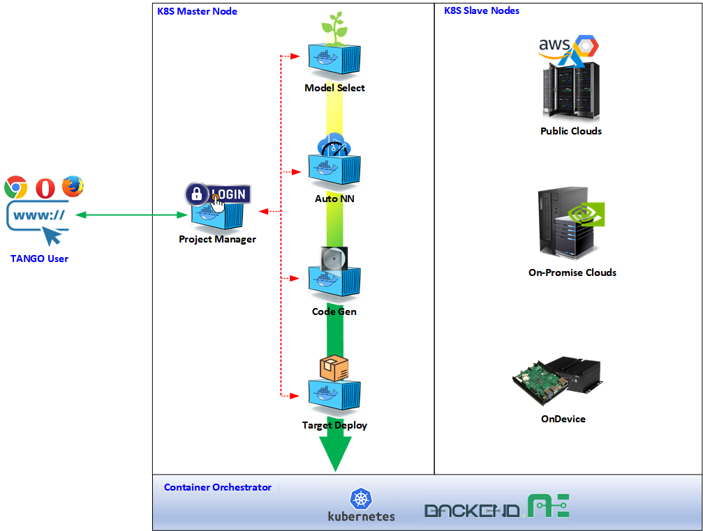
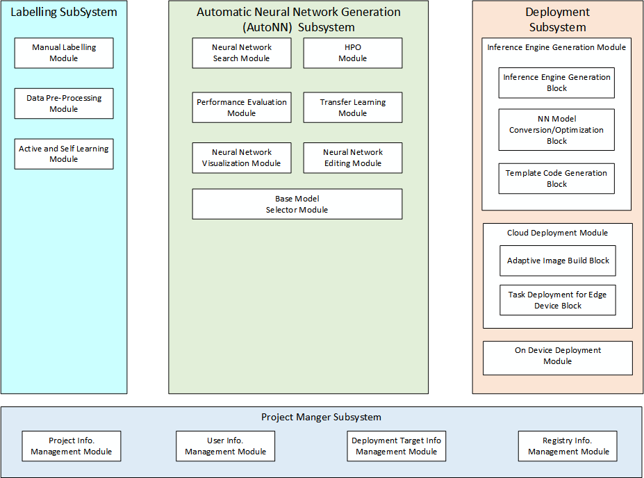
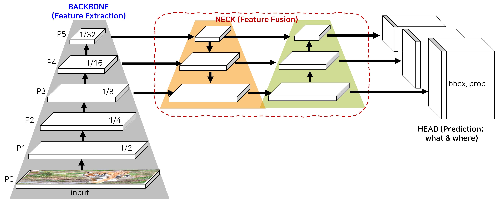
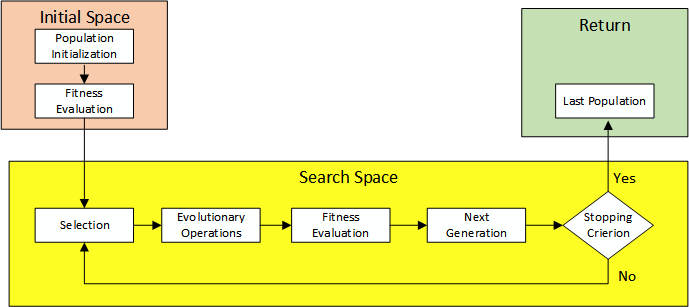
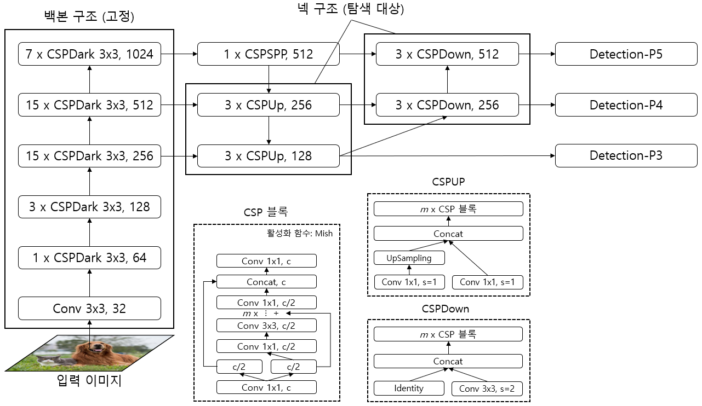
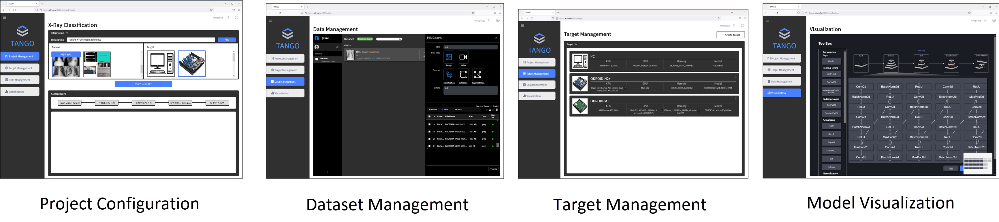
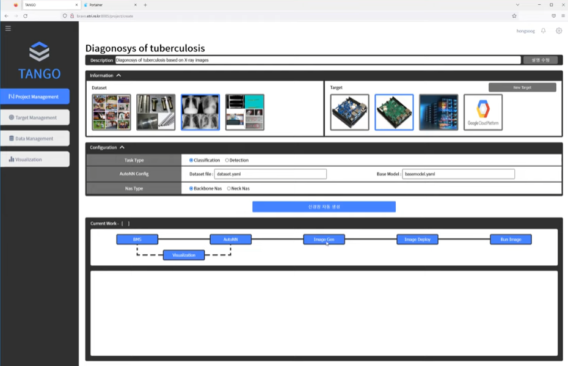

# TANGO

> **Announcement**  
> * [2022  Fall TANGO Community Conference](https://github.com/ML-TANGO/TANGO/discussions/31)
> * [2022  Fall TANGO Pre-Release](https://github.com/ML-TANGO/TANGO/releases/tag/tango-22.11-pre1)
> * [2022  Fall TANGO Release](https://github.com/ML-TANGO/TANGO/releases/tag/tango-22.11) 
----

## Introduction to TANGO <a name="intro"></a>

TANGO (**T**arget **A**daptive  **N**o-code neural network **G**eneration and **O**peration framework) is code name of project for Integrated Machine Learning Framework.

It aims to develop automatic neural network generation and deployment framework that helps novice users to easily develop neural network applications with less or ideally no code efforts and deploy the neural network application onto the target device.

The users of TANGO just prepare their labelled datasets to train models and target devices. Then, TANGO analyzes the datasets and target devices characteristics, generates task-specific neural network based on user requirements, trains it with the datasets, creates Docker container images and deploys the container images onto target device.

TANGO uses container technology and MSA (Micro Service Architecture). Containers require less system resources than traditional or hardware virtual machine environments because they don't include operating system images. Applications running in containers can be deployed easily to multiple different operating systems and hardware platforms. The deployment of TANGO supports the frameworks of Pytorch, RKNN and ACL. Additionally, the deployment will support TensorRT, TVM, and more.

Each component of TANGO is self-contained service component implemented with container technology.
The component interacts with other component via REST APIs as depicted in the following image;



----

## Main Feature of TANGO

The TANGO framework aims to deploy and load ready-to-use deep learning models for the specific vision task (classification, object detection, or instance segmentation) onto the user's target devices by automatically constructing and training deep learning models without the help of experts or with minimal knowledge on usage on TANGO. To this end, data preparation, neural network model creation, and optimization for target device can be accomplished within TANGO framework.



----

### Data Preparation

Data preparation consists of two main processes. First, you need to take or collect images (raw data) in various situations suitable for the given vision task. Then, collected row data should be annotated to be used for training of depp learning models. The latter process is very labor intensive and takes a lot of manpower and time. TANGO's labeling tool is a Web-based GUI tool that enables the users easily perform annotation on raw data. The user can load local raw data by just drag and drop style, perform class labeling, bounding box annotation, polygon annotation, etc. according to the specific task, and then save them.


### Auto NN: Automatic Neural Network Generation

AutoML (Automated Machine Learning) refers to the process of automating the end-to-end machine learning process, including tasks such as data preprocessing, model selection, hyperparameter tuning, and model deployment. The goal of AutoML is to make it easier for non-experts to build and deploy machine learning models, by removing the need for extensive domain knowledge or manual intervention.

Neural network model generation is a key process in the TANGO framework. The TANGO framework provides guidelines for this kind of task automatically. First, a base neural network is extracted through a base model selector recommended by one of the existing SOTA, State of the Art, neural networks proved to work well. Afterwards, AutoNN uses automation techniques such as NAS ([Neural Architecture Search](https://en.wikipedia.org/wiki/Neural_architecture_search)) and HPO ([Hyper Parameter Optimization](https://en.wikipedia.org/wiki/Hyperparameter_optimization)) to find an appropriate neural network configuration. This includes retraining of the final model.


#### BMS: Basic Model Selection

Before applying automation techniques such as NAS and HPO, reducing the search space or limiting it to a specific neural network variation is very important in terms of the efficiency of automatic neural network generation. In the TANGO framework, it was named Base Model Selection and was assigned a role of recommending an appropriate neural network among existing well-known neural networks, so called SOTA model.

Model selection is typically done through an algorithm search process. The system may evaluate a set of candidate SOTA models using metrics such as accuracy, precision, recall, or F1 score, and select the model that performs best on a validation dataset. 

#### NAS: Neural Architecture Search

Neural Architecture Search (NAS) is a method for automatically searching for the best neural network architecture for a given task, rather than requiring the practitioner to manually design and fine-tune the network. The process of NAS involves searching the space of possible network architectures to find the one that performs best on a validation dataset. 

NAS has the potential to significantly reduce the time and effort required to design neural networks, especially for complex tasks where the optimal architecture is not clear. It also enables the discovery of novel network architectures that outperform hand-designed ones, leading to improved performance on a wide range of tasks. However, NAS can be computationally expensive and require large amounts of computing resources, making it challenging to apply in practice.

Finding the optimal neural network has long been the domain of AI experts. As the basic operations, layers, and blocks used in neural networks become matured, finding a better neural network architecture through combining them can be iterative work. Therefore, rather than finding a new operation, layer, or block, NAS technology uses the computer with the task of finding a better neural network structure from the possible combination of developed operations, layers, and blocks or changing their parameters. NAS in TANGO can be seen as a process of deriving an optimal user-customized neural network through NAS based on the base neural network recommended by BMS.


#### HPO: Hyper-Parameter Optimization

Even though neural network training is largely automated, there are still many variables that should be setup in advance or tunned during training. This kind of variables is called hyper-parameters. HPO stands for Hyperparameter Optimization, which is the process of tuning the hyper-parameters of a machine learning model to improve its performance on a validation dataset. Hyper-parameters are parameters that are set before training a model and control aspects of the training process such as the learning rate, the number of trees in a random forest, or the number of hidden units in a neural network. Therefore, HPO in TANGO can be seen as an iterative process of determining the optimal values of hyper-parameters to achieve the best performance for the optimal neural network derived from NAS.


### Deployment of Inference Engine on Target Device

During TANGO project configuration, users can specify theirs target device, which is used for inference with pre-trained neural network model. Due to different acceleration engines and available resources for each device, it may be difficult to immediately deploy/load the neural network model output from AutoNN. Therefore, in order to realize full-cycle AutoML, a tool is necessary to  help deploy/install on the target device and launch inference task. Depending on the environment of the target device, TANGO provides a method that can be distributed over the network through direct containerized image build, and a method that makes the executable code including essential libraries and pre/post-processing code into a compressed file and installs it on the the target device and unpacks it.


### Object Detection Neural Networks

TANGO framework currently supports automatic generation of an object detection model.  An object detection model typically consists of backbone, neck and heads

The backbone refers to the feature extractor part of the model, which is responsible for extracting high-level features from the input image. This is typically a convolutional neural network (CNN) pre-trained on a large image classification dataset, such as ImageNet.

The neck is the part of the model that connects the backbone to the head. Its role is to aggregate and refine the features extracted by the backbone, to prepare them for the final prediction stage. The neck can have various architectural designs, such as a simple average pooling layer, or a more complex set of convolutional and dense layers.

The head refers to the prediction module, which uses the features from the neck to perform the final object detection task. It typically includes one or more fully connected layers, and a loss function that measures the model's performance on the task. The head can also include anchor boxes, anchor scaling and aspect ratios, and non-maximum suppression, which are techniques used to improve the model's accuracy and efficiency.

These components work together to detect objects in an image, by first generating a set of candidate regions and then refining the predictions to produce accurate and precise bounding boxes. The specific design and architecture of an object detection model will depend on the requirements of the task and the available computational resources.



In the case of the backbone and neck, appropriate models may depend on the capacity of the target device the user intends to use for inference and the object to be detected. To find the optimal models automatically, the TANGO framework performs Backbone NAS and Neck NAS respectively. For the heads, a heads in YOLO series model was used. which is mainly used in real-time object detection neural networks, was used. YOLO series models are known as the most successful real-time object detection model in 1-stage object detection. In the current TANGO framework, you can select Backbone NAS and/or Neck NAS within project workflow configuration.

#### Backbone NAS

In order to get the target device-tailored backbone that the TANGO framework aims for, the delay time measurement function for each operator in the neural network was modularized, and based on this, the complexity and search time of the search algorithm were minimized. For efficient multi-scale information extraction, a weight-sharing supernet learning was performed using an evolutionary algorithm-based neural network structure search strategy to output a backbone neural network.



#### Neck NAS

Neck NAS is a module for finding a neural network that can more accurately predict object locations by performing NAS in the neck component, which is specialized for object detection neural networks. As one of the methods, a block-by-block search was performed based on YOLO's FPN+PAN structure.



Unlike above example which illustrates block-based search, the neck structure itself can be searched. To this end, a super-neck was created based on the neck of YOLOv5, and a search was conducted to determine which connection had the best performance.


### No Code

The TANGO framework aims to help users without specialized knowledge to create and use their own neural network models. To this end, it provides an environment that users can use without writing code, such as a project manager and a neural network visualization tool.



You can watch 2022 early version demo on Youtube. Click the below images.

<a href="https://youtu.be/T80YKRyIR3g">

</a>


## Source Tree Structure <a name="source_tree"></a>

The source tree is organized with the MSA principles: each subdirectory contains component container source code. Due to the separation of source directory, component container developers just only work on their own isolated subdirectory and publish minimal REST API to serve project manager container's service request.

```bash
$ tree -d -L 2
.
├── project_manager            # front-end server for TANGO
│   ├── backend
│   ├── data
│   ├── tango
│   ├── frontend
│   └── static
│
├── labelling             # data labelling tool
│   ├── backend
│   └── labelling
│
├── base_model_select     # base model selection
│
├── autonn                # automatic neural network
│   ├── autonn
│   └── backend
│
├── target_image_build    # build neural network image to be deployed
│   ├── backend
│   └── target_image_build
│
├── target_deploy         # generated neural network deployment to target
│   ├── backend
│   └── target_deploy
│
├── visualization         # neural network model visualization
│
└── docs                  # project documentation

```

----


## How to build images and run containers <a name="img_build_container_run"></a>

refer to TANGO wiki [HowTo | TANGO Image Build and Run](https://github.com/ML-TANGO/TANGO/wiki/HowTo-%7C-TANGO-Image-Build-and-Run)


----

## Developer Guides and References<a name="dev_guides"></a>

* [TANGO Architecture Overview](https://github.com/ML-TANGO/TANGO/wiki/Guides-%7C-TANGO-Architecture)
* [TANGO Container Port Mapping guide](https://github.com/ML-TANGO/TANGO/wiki/Guides-%7C-Container-Port-Map)
* [Exchanging Data among Containers](https://github.com/ML-TANGO/TANGO/wiki/Guides-%7C-Exchanging-Data-among-Containers)
* [TANGO REST API Guide](https://github.com/ML-TANGO/TANGO/wiki/Guides-%7C-Rest-API)

----

## TANGO on media

YouTube Videos
* [ 성공하는 SW기업을 위한 AI, SW개발도구 'TANGO'](https://youtu.be/IwyHOl3WjWQ)
  * 2022 SW공학 TECHNICAL 세미나, 떠오르는 기업의 품질 확보 활동 
  * 2022년 11월 23일(수) 15:30 ~ 17:30 
  * 비앤디파트너스 삼성역점 M3 회의실

* [TANGO, 노코드 신경망 자동생성 통합개발 프레임워크의 품질 관리](https://youtu.be/jrJCXAPKJn8)
  * 2022 SW QUALITY INSIGHT CONFERENCE
  * 2022년 12월 7일(수) 15:30~17:30 
  * COEX 그랜드 컨퍼런스룸 402호


## Acknowledgement <a name="ack"></a>

This work was supported by [Institute of Information & communications Technology Planning & Evaluation (IITP)](https://www.iitp.kr/) grant funded by the Korea government(MSIT) (**No. 2021-0-00766**, _Development of Integrated Development Framework that supports Automatic Neural Network Generation and Deployment optimized for Runtime Environment_).
