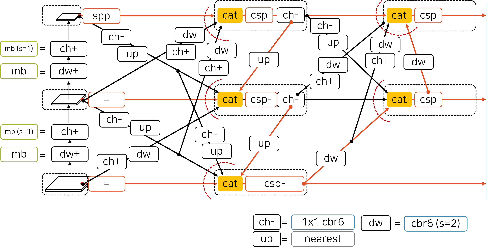

# AutoNN

1. Intall NNI
2. Setup Anaconda Virtual Environment
  - Install PyTorch with CUDA 11
  - Install some required python packages (e.g. PyYAML, numpy, scipy, etc.)
  
  > ## tenace's environment
  > * python 3.8.15
  > * pytorch 1.9.1
  > * cuda 11.3.1
  > * cudnn 8.2.1
  > * pyyaml 6.0
  > * numpy 1.22.3
  > * onnx 1.10.2
  > * nni 2.10 
  > * tensorboard 2.11.0
  > * opencv 4.5.1
  
  
  
  ## Installation example
  ```bash
  conda create -n autonn_env python=3.8
  conda activate autonn_env
  conda install pytorch==1.9.1 torchvision==0.10.1 torchaudio==0.9.1 cudatoolkit=11.3 -c pytorch -c conda-forge
  conda install pyyaml tqdm pandas seaborn scipy
  conda install -c conda-forge tensorboard
  conda install -c conda-forge opencv
  conda install -c conda-forge matplotlib
  conda install -c conda-forge
  pip install thop
  pip install torch-tb-profiler
  pip install setuptools==59.5.0  
  ```
  
3. Clone this repo and execute main.py
```bash
git clone https://github/HyunwooCho/AutoNN
cd AutoNN
python main.py --nas_type ConcatEntirePath --dataset yaml/dataset.yaml --batch 32
```

3.1 To resume (when you stoped AutoNN for some reason before the end of epochs)
```bash
cd AutoNN
python main.py --resume runs/train/exp/weights/lastmodel.pt
```

3.2 To resue pretrained model as initial weights
```bash
cd AutoNN
python main.py --weights runs/train/exp/weights/bestmodel.pt --epoch 1000
```

> **Note** 
> Temporarily, you can test YOLOv5 trainer code as the following command.
> It will build the neural network from the version 5 YOLOv5 backbone and neck
``` bash
cd AutoNN
python main.py --nas_type Yolov5Trainer
```

> Compared to that, you can test Neck-NAS evaluator codes.
> It will perform --nas_type ConcateBasedNet by default
```bash
cd AutoNN
python main.py
```

Both of two result in about 16% mAP@.5:.95 at COCO128 dataset, 300 epochs

It is temporary and not compeleted.
  - It is based on [NNI](https://github.com/microsoft/nni/) and [YOLO V.5](https://github.com/ultralytics/yolov5).
  - Currently, it only performs creating backbone & neck architecure from yaml file.

# Super-Neck

Current Implementation for Super-Neck Architecture

