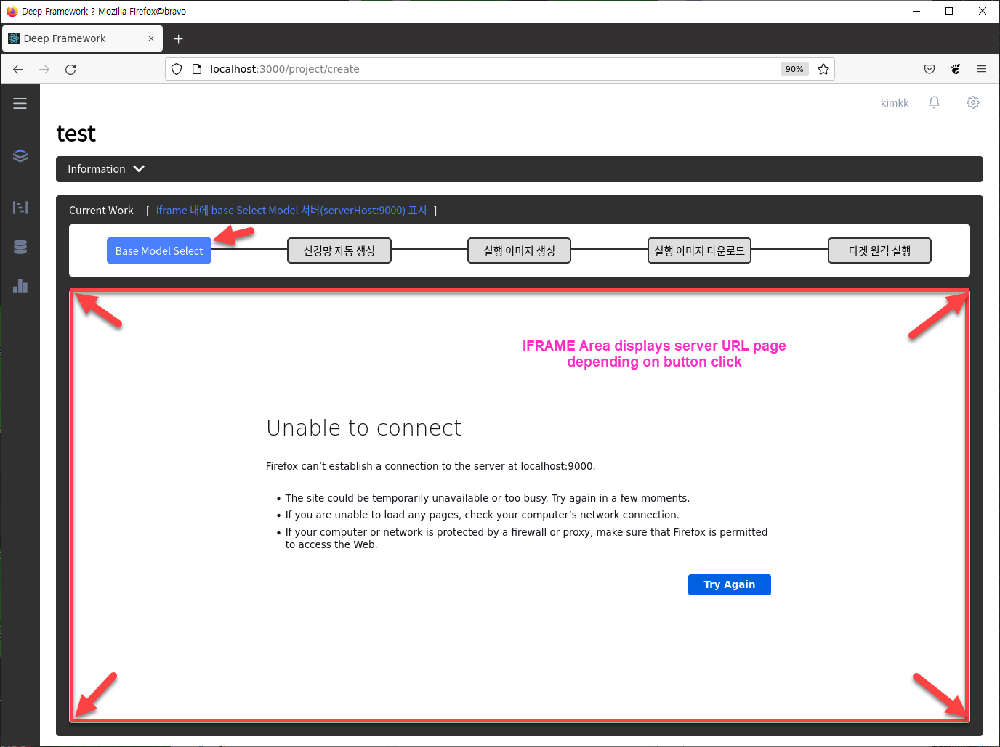

# DeepFramework UI Manager

----

### Ports
    8085

----

### PORT 번호 변경시

####  docker-compose.yaml 파일 수정
    'web' 항목의 'command' 명령어 수정 ( 기존 8085 PORT 번호 변경 )
    'web' 항목의 'ports' 수정         ( 기존 8085 PORT 번호 변경 )

----

### Source Structure

```bash
    ├── backend [ django 프로젝트 ]
    │   └── __init__.py
    │   └── asgi.py
    │   └── settings.py     ( django 프로젝트의 전체 설정 : DB 설정 등 포함 )
    │   └── urls.py         ( url 주소 )
    │   └── wsgi.py
    │ 
    ├── data 
    │   ├── datasets        ( 레이블링 저작도구의 데이터셋이 저장될 디렉토리 )
    │   └── targets         ( 타겟 정보들을 저장할 디렉토리 )
    │ 
    ├── deep_framework [ django app - rest API 수행 ]
    │   └── migrations
    │   └── __init__.py
    │   └── admin.py
    │   └── apps.py
    │   └── models.py       ( ORM - DB 연동 클래스 모음 )
    │   └── serializers.py
    │   └── tests.py
    │   └── urls.py         ( url 주소 )
    │   └── views.py        ( 서버 역활 수행 )
    │   └── viewsProject.py ( 서버 역활 수행 )
    │ 
    ├── frontend [ react ]
    │   ├── build
    │   ├── node_modules ( 현재 프로젝트에는 포함되지 않음 : react 개발을 위한 패키지 모음 )
    │   ├── public
    │   └── src          ( react UI 스크립트 - UI ) 
    │ 
    └── static [ 정적 파일 모음 ]
```

----

### Docker volume
    deepframework_postgreSQL

#### Docker volume 리스트 확인 명령어
    docker volume ls

----

### DB
    postgresql


----

### Routes used in AutoNN workflow 



Routes (URL) for container port forward are as follows:

<table class="relative-table confluenceTable wrapped" data-resize-percent="52.108649035025024"><colgroup><col style="width: 25.4121%;" data-resize-pixel="185" data-resize-percent="25.412087912087912" data-offset-left="40.49715805053711" data-offset-right="225.4971580505371" /><col style="width: 31.5934%;" data-resize-pixel="229.99998474121094" data-resize-percent="31.593404497419087" data-offset-left="225.4971466064453" data-offset-right="455.49713134765625" /><col style="width: 43%;" data-resize-pixel="313.0397644042969" data-resize-percent="42.99996763795287" data-offset-left="455.49713134765625" data-offset-right="768.5368957519531" /></colgroup><tbody><tr><th class="confluenceTh">Button Name&nbsp;</th><th class="confluenceTh" colspan="1" width="">In English</th><th class="confluenceTh">URL used for IFRAME</th></tr><tr><td class="confluenceTd">Base Model Select</td><td class="confluenceTd" colspan="1" width="">Base Model Select</td><td class="confluenceTd">http://ServerHost :9000</td></tr><tr><td class="confluenceTd" colspan="1">신경망 자동 생성</td><td class="confluenceTd" colspan="1" width="">Auto NN Generation</td><td class="confluenceTd" colspan="1"><a href="http://ServerHost">http://ServerHost</a> :9001</td></tr><tr><td class="confluenceTd" colspan="1">실행 이미지 생성</td><td class="confluenceTd" colspan="1" width="">NN Image Generation</td><td class="confluenceTd" colspan="1"><a href="http://ServerHost">http://ServerHost</a> :9002</td></tr><tr><td class="confluenceTd" colspan="1">실행 이미지 다운로드</td><td class="confluenceTd" colspan="1" width="">NN Image Deploy</td><td class="confluenceTd" colspan="1"><a href="http://ServerHost">http://ServerHost</a> :9003</td></tr><tr><td class="confluenceTd" colspan="1">타겟 원격 실행</td><td class="confluenceTd" colspan="1" width="">Run NN Image on Target</td><td class="confluenceTd" colspan="1"><a href="http://ServerHost">http://ServerHost</a> :9004</td></tr></tbody></table>

**Note**
> the port numbers  in the URL used for IFRAME are temporary assigned for simple testing of container behavior. hence, it can be changed.
